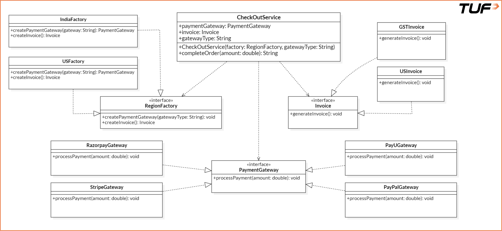

# Abstract Factory Pattern

The AbstractFactory Pattern is a creational design pattern that provides an interface for creating families of related or dependent objects without specifying their concrete classes.

In simpler terms:
You use it when you have multiple factories, each responsible for producing objects that are meant to work together.

### **When Should you use it?**

Use of Abstract Factory Pattern is appropriate in the following scenarios:
* When multiple related objects must be created as part of cohesive set(e.g., a payment gateway and its corresponding invoice generator).
* When the type of objects to be instantiated depends on a specific context, such as country, theme or platform.
* When client code should remain independent of concrete product classes.
* When consistency across a family of related products must be maintained (e.ge., a US payment gateway paired with a US-style invoice)

### Issues with noAbstract.java
* Tight Coupling:
  * The CheckoutService directly created instance s of RazoreapayGateway, PayUGateway, and GSTInvoice, making it dependent on specific implements.
* Violation of OCP:
  * ANy addition of new payment fateways or invoice types will require modifying the CheckoutService class.
* Lack of Extensibility:
  * Hardcoding limits the ability to support other countries or multiple combinations of payment methods and invoice formats.

**Improved Design: Abstract Factory Pattern for CheckoutService**
WithAbstract.java follows the Abstract Factory Pattern to cleanly separate the creation of PaymentGateway and Invoice objects from the business logic of CheckoutService

**How this code fixes the original issues**
* Object creation logic was mixed with business logic:
  * Now moved to separate factory classes like IndiaFactory
* Concrete classes like RazorPay and PayU were hardcoded in the service:
  * Replaced with abstraction (PaymentGateway, Invoice) and created via interfaces
* Adding a new gateway or invoice type required modifying CheckoutService:
  * Now, new gateways or invoices can be added by updating/ adding new factory - no changes required in the service class
* Thw code was difficult to maintain and scale across regions:
  * Now easy to maintain and scale by plugging in region-specific factories (e.g., USFactory, IndiaFactory, etc)

**Key Benefits of Abstract Pattern design**
* Scalable: Added new countries or payment systems by simply creating new factories.
* Clean and Maintainable: CheckoutService doesn't care what kind of gateway or invoice it's using.
* Easy to Test: Each factory can be tested independently with its own unit tests.
* Follows SOLID Principles: Especially the OCP and Dependency Inversion Principle

