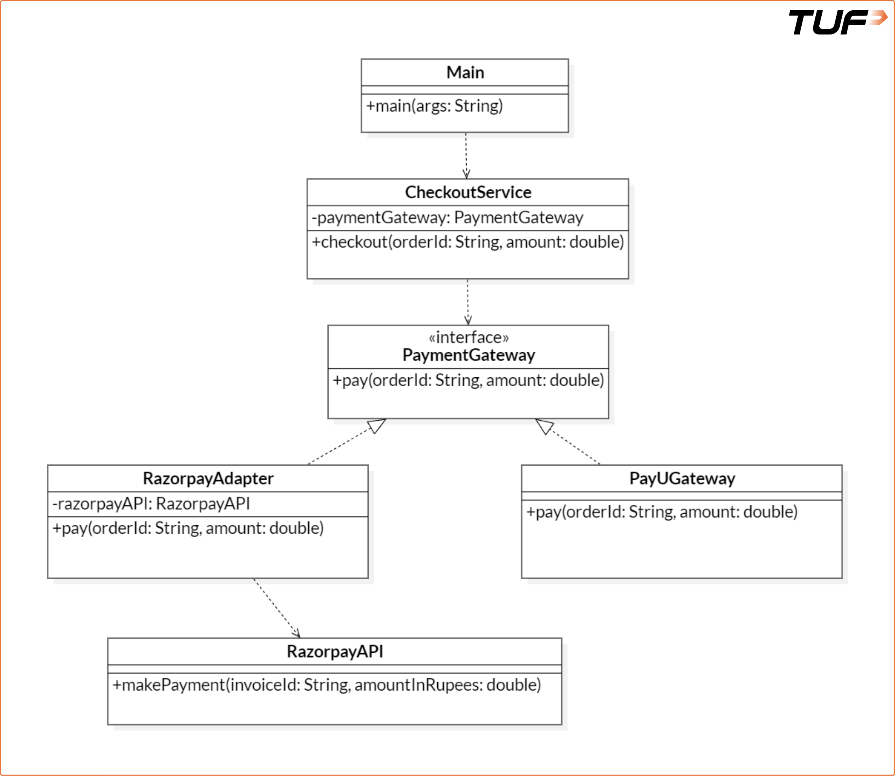

Adapter Pattern:

The Adapter Pattern allows incompatible interfaces to work together by acting as a translator or wrapper around an existing class. It converts the interface of a class into another interface that a client expects.

It acts as a bridge between the Target interface (expected by the client) and the Adaptee(an existing class with a different interface). This structural wrapping enables integration and compatibility across diverse systems.

Real-Life Analogy

Imagine traveling from India to Europe. Your mobile charger doesn't fit into European sockets. Instead of buying a new charge, you use a plug adapter. The adpater allows your charger (with its Indian plug) to fit the European socket, enabling charging without modifying either the socket or the charger,

